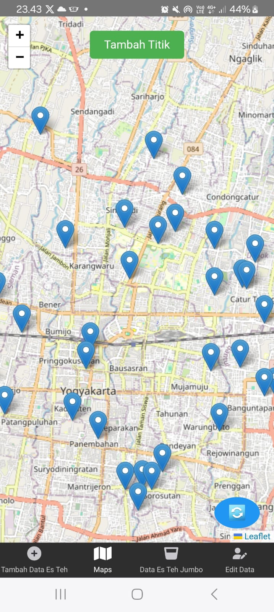
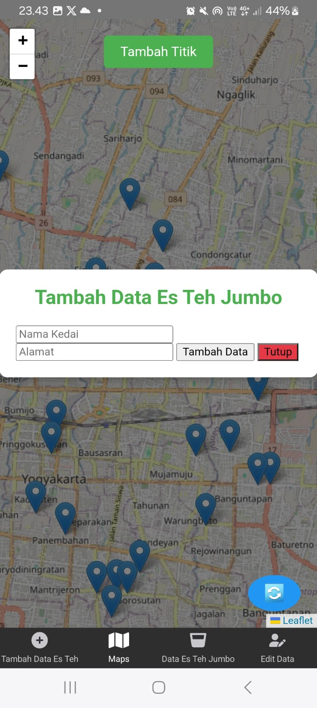
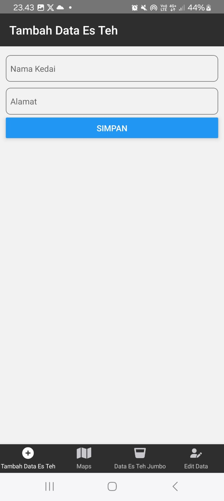
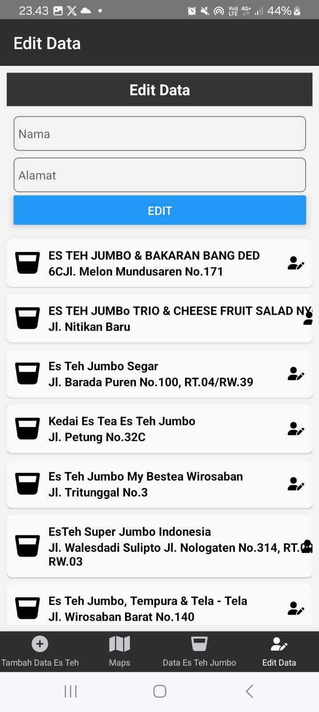
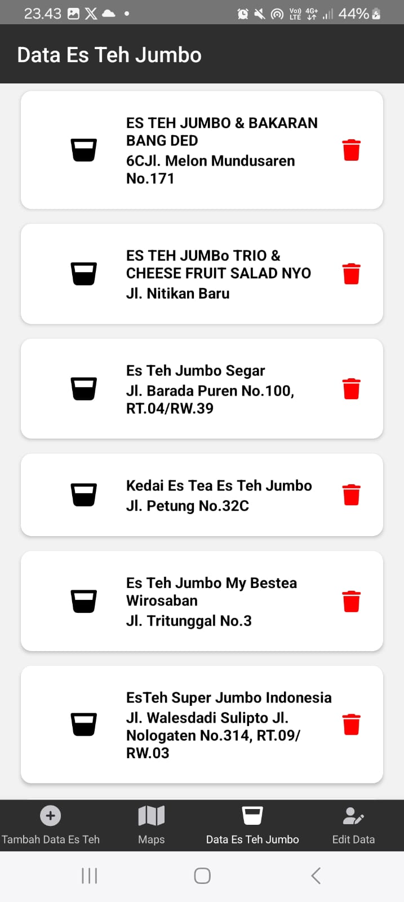

Berikut adalah deskripsi produk yang telah disesuaikan untuk aplikasi **Cari Es Teh Jumbo!**:  

# Nama Produk: Cari Es Teh Jumbo!

## Deskripsi Produk
**Cari Es Teh Jumbo!** adalah aplikasi mobile yang dirancang untuk mempermudah pengguna dalam menemukan kedai es teh favorit di sekitar mereka. Aplikasi ini bertujuan untuk memberikan pengalaman pencarian yang cepat, akurat, dan menyenangkan, sehingga pecinta es teh dapat dengan mudah menemukan lokasi, ulasan, serta informasi detail mengenai kedai yang menawarkan es teh jumbo terbaik.

### Fitur Utama:
- **Tambah Data**: Temukan kedai es teh jumbo terdekat dengan bantuan peta interaktif.
- **Informasi Detail**: Lihat nama kedai, alamat
- **Edit Data**: Pengguna dapat berkontribusi dengan menambahkan kedai baru yang belum terdaftar.
- **Peta Interaktif**: Visualisasi lokasi kedai yang mempermudah pengguna menjelajahi area sekitar.

Dengan antarmuka yang sederhana dan ramah pengguna, **Cari Es Teh Jumbo!** adalah solusi terbaik bagi pecinta es teh di mana saja. 

## Teknologi yang Digunakan
1. **React Native**  
   Framework utama untuk pengembangan aplikasi mobile lintas platform, mendukung Android dan iOS dengan performa optimal.
2. **Metro Bundler**  
   Alat bawaan dari React Native yang berfungsi untuk mengolah dan membundel kode JavaScript.
3. **Node.js**  
   Platform runtime JavaScript yang digunakan untuk mengelola dependensi aplikasi serta menjalankan skrip pengembangan.
4. **Android Studio & Source Code**  
   Alat pengujian yang menyediakan emulator untuk Android dan simulator untuk iOS, memudahkan pengembangan dan debugging aplikasi.
5. **RESTful API** *(Opsional)*  
   Backend berbasis API untuk mengelola data dan memberikan layanan komunikasi antara aplikasi dan server jika diperlukan.
6. **Data Scraping**  
   Teknologi pengumpulan data otomatis dari berbagai sumber untuk memperbarui informasi kedai es teh jumbo, seperti lokasi, ulasan, dan menu terkini.

## Sumber Data
**Data Scraping**  
   Teknologi pengumpulan data otomatis dari berbagai sumber untuk memperbarui informasi kedai es teh jumbo, seperti lokasi, ulasan, dan menu terkini.

## Tangkapan Layar
Berikut adalah beberapa tangkapan layar dari aplikasi **Cari Es Teh Jumbo**:

### Halaman Utama

### Halaman Input Data

### Halaman List Data

### Halaman Maps

### Halaman Edit Data

